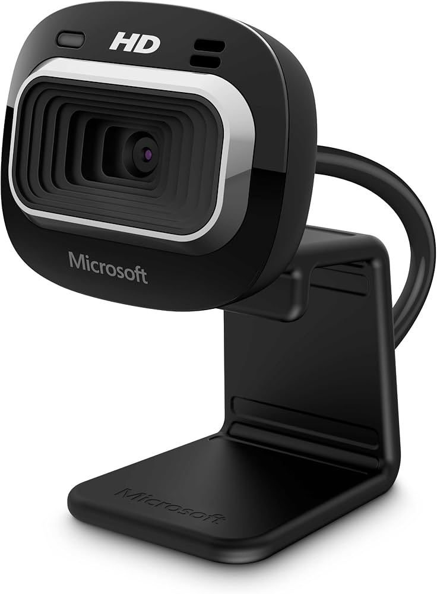

# microsoft HD-3000 Web Camera

### Key Specifications:
- Video Resolution: (720p HD) at 30 fps.
- Image Sensor: 1.3 Megapixel CMOS.
- Field of View: 78-degree wide angle.
- Focus: Fixed Focus.
- Aspect Ratio: 16:9 widescreen.
- Interface: USB 2.0.

